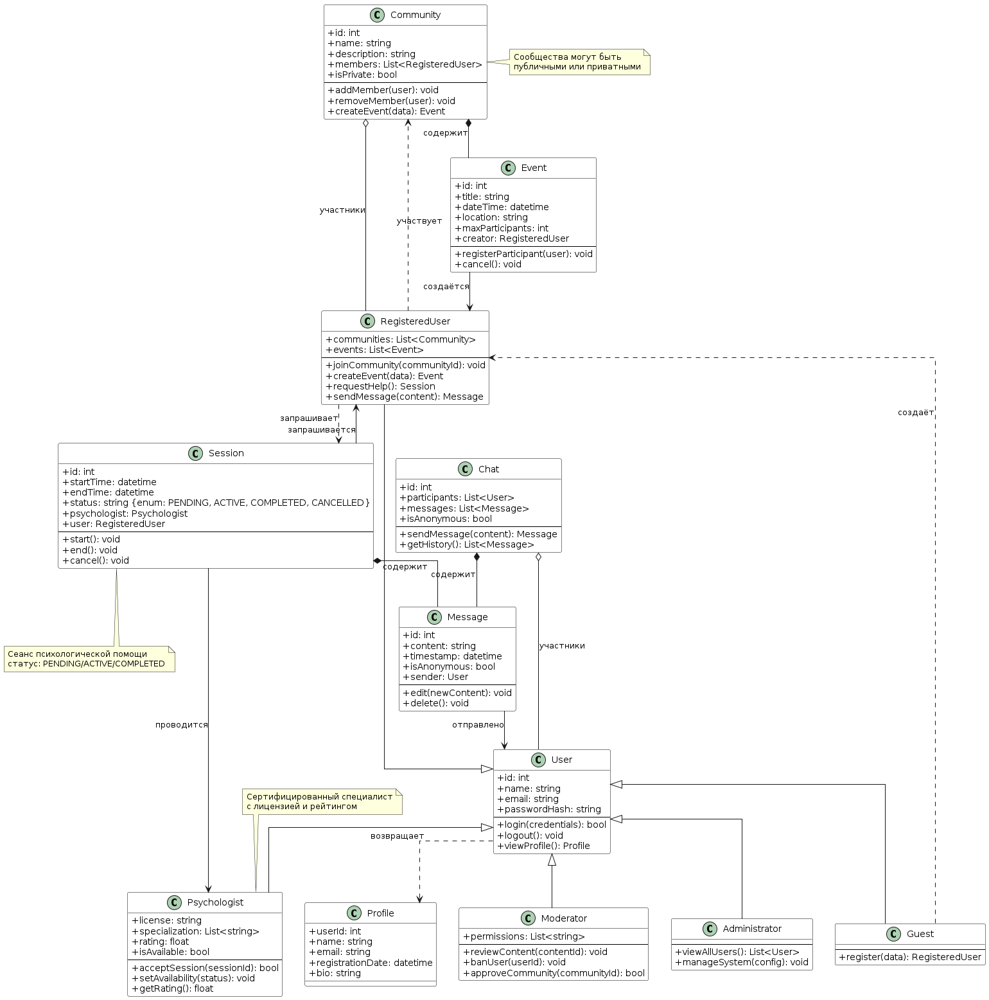

# 🔹 Лабораторная работа №1
## 🎯 Описание диаграммы классов

Диаграмма классов моделирует систему HelpHub — платформу для психологической поддержки и организации сообществ.

### Основные классы:

**Абстрактный класс `User`** (`id`, `name`, `email`, `passwordHash`) определяет общее поведение:
- `login()` — аутентификация
- `logout()` — завершение сеанса
- `viewProfile()` — просмотр профиля

**От него наследуются:**
- `RegisteredUser` — обычный пользователь (методы: `joinCommunity()`, `createEvent()`, `requestHelp()`)
- `Psychologist` — сертифицированный специалист (методы: `acceptSession()`, `setAvailability()`, `getRating()`)
- `Moderator` — модератор контента (методы: `reviewContent()`, `banUser()`, `approveCommunity()`)
- `Administrator` — администратор системы (методы: `viewAllUsers()`, `manageSystem()`)
- `Guest` — незарегистрированный посетитель (метод: `register()`)

**Класс `Community`** хранит:
- `id`, `name`, `description`, `members` (список участников), `isPrivate`

**Класс `Event`** хранит:
- `id`, `title`, `dateTime`, `location`, `maxParticipants`, `creator`

**Класс `Session`** (сеанс психологической помощи):
- `id`, `startTime`, `endTime`, `status`, `psychologist`, `user`

**Класс `Message`** (сообщение в чате):
- `id`, `content`, `timestamp`, `isAnonymous`, `sender`

**Класс `Profile`** возвращает информацию о пользователе:
- `userId`, `name`, `email`, `registrationDate`, `bio`

---

## 📊 Отношения между классами

| Тип отношения | Классы | Описание |
|--------------|--------|----------|
| **Наследование** | `User` ← `RegisteredUser`, `Psychologist`, `Moderator`, `Administrator`, `Guest` | Общие атрибуты и методы |
| **Композиция** | `Community` ◆ `Event` | Мероприятия принадлежат сообществу |
| **Композиция** | `Session` ◆ `Message` | Сообщения принадлежат сессии |
| **Агрегация** | `Community` ◊ `RegisteredUser` | Пользователи участвуют в сообществах |
| **Ассоциация** | `Session` → `Psychologist` | Сессия проводится специалистом |
| **Ассоциация** | `Session` → `RegisteredUser` | Сессия запрашивается пользователем |
| **Зависимость** | `Guest` → `RegisteredUser` | Гость создаёт аккаунт |
| **Зависимость** | `RegisteredUser` → `Session` | Пользователь запрашивает помощь |
| **Зависимость** | `User` → `Profile` | Пользователь возвращает профиль |

---

## 🖼️ UML Class Diagram

---

## 📁 Исходные файлы

| Файл | Описание |
|------|----------|
| `lab1.png` | Экспортированное изображение диаграммы |
| `main.wsd` | Исходный код диаграммы (PlantUML) |

---

## ✅ Вывод

Таким образом, система HelpHub поддерживает:
- ✅ Регистрацию и аутентификацию пользователей разных ролей
- ✅ Создание и управление сообществами по интересам
- ✅ Планирование и организацию мероприятий
- ✅ Запрос экстренной психологической помощи
- ✅ Анонимный чат с модерацией

Диаграмма классов отражает статическую структуру системы и готова для использования в дальнейшей разработке мобильного приложения.
