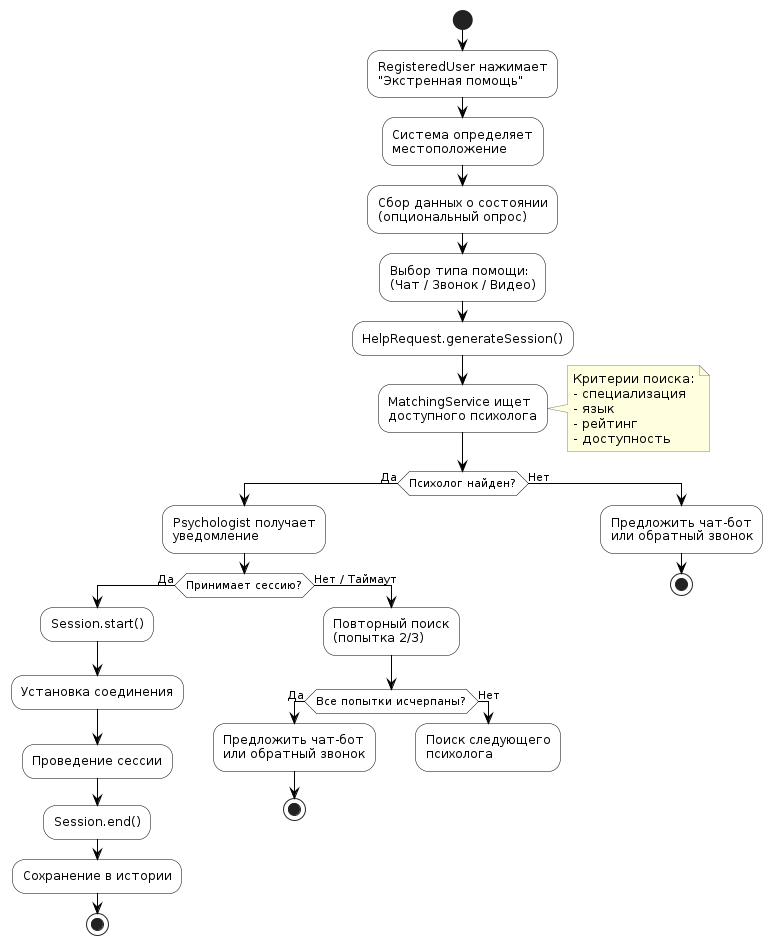

# 🔹 Лабораторная работа №2

## Диаграммы Состояний, Активности, Последовательности, Взаимодействия
## 🎯 Цель работы

1. Изучить динамические диаграммы UML.
2. Смоделировать поведение системы HelpHub во времени.
3. Построить 4 типа диаграмм для ключевого сценария: **«Запрос экстренной психологической помощи»**.

---

## 📋 1. Диаграмма активности: Запрос экстренной помощи

### Описание процесса

Диаграмма активности описывает процесс выполнения запроса экстренной психологической помощи. 

**Пользователь** начинает с нажатия кнопки экстренной помощи (`requestEmergencyHelp`), после чего **система** определяет местоположение и собирает данные о состоянии пользователя. 

**RegisteredUser** выбирает тип помощи (чат, звонок, видеосессия), система генерирует новую сессию (`generateSession`) и находит доступного психолога. 

**Psychologist** получает уведомление и может принять или отклонить запрос (`acceptSession`). 

- ✅ Если психолог принимает — создаётся объект `Session` с сохранением данных (время, тип, участники), после чего устанавливается соединение.
- ❌ Если психолог отклоняет или таймаут — система ищет следующего доступного специалиста.
- ⏱️ Если все психологи недоступны — пользователю предлагается чат-бот или обратный звонок.

### Диаграмма активности

---

## 📋 2. Диаграмма взаимодействия: Запрос экстренной помощи

### Описание взаимодействия

Диаграмма взаимодействия показывает обмен сообщениями между актёром **RegisteredUser** и объектами **HelpRequest**, **Session**, **Psychologist**, **Notification**.

**Пользователь** инициирует запрос экстренной помощи (`requestEmergencyHelp`), после чего **RegisteredUser** создаёт объект `HelpRequest` с данными (локация, тип помощи, срочность).

**HelpRequest** делегирует поиск психолога объекту **MatchingService**, который находит доступного **Psychologist** и отправляет уведомление.

В случае принятия сессии создаётся объект **Session** с сохранением данных, и пользователю возвращается подтверждение. При отклонении — система повторяет поиск.

### Диаграмма взаимодействия

---

## 📋 3. Диаграмма последовательности: Запрос экстренной помощи

### Описание последовательности

Диаграмма последовательности детализирует временной порядок взаимодействий между актёром **RegisteredUser** и объектами **HelpRequest**, **MatchingService**, **Psychologist**, **Session**.

1. После нажатия кнопки экстренной помощи активируется объект **RegisteredUser**, который создаёт **HelpRequest**.
2. **HelpRequest** вызывает `findAvailablePsychologist()` у **MatchingService**.
3. **MatchingService** отправляет `notifyEmergency()` выбранному **Psychologist**.
4. **Psychologist** отвечает `acceptSession()` или `declineSession()`.
5. Альтернативный фрагмент (**alt**) разделяет сценарии:
   - ✅ При принятии: создаётся и сохраняется **Session**, пользователь получает соединение.
   - ❌ При отклонении: повторяется поиск следующего психолога (до 3 попыток).
6. Фрагмент **opt** (опционально): если все психологи недоступны — предлагается чат-бот.

### Диаграмма последовательности

---

## 📋 4. Диаграмма состояний: Session

### Описание жизненного цикла

Диаграмма состояний описывает жизненный цикл сессии психологической помощи (**Session**).

**Начальное состояние** `Created` достигается после вызова `generateSession()`.

Из `Created` переход в `Waiting` осуществляется методом `notifyPsychologist()` (ожидание подтверждения психолога).

**Внутри `Waiting`** возможны переходы:
- При принятии психологом → `Active` (метод `startSession()`)
- При таймауте (> 5 мин) → `Expired`

**Внутри `Active`** сессия находится в подсостоянии `InProgress`. 
- При завершении пользователем или психологом → `Completed` (метод `endSession()`)
- При разрыве соединения → `Interrupted` (возможен `reconnect()`)

**Из `Completed`** сессия завершается, сохраняется запись в истории.

**Из `Interrupted`** возможен повторный переход в `Active` через `reconnect()` (в течение 10 минут).

### Диаграмма состояний

---

##  Исходные файлы

| Файл | Описание |
|------|----------|
| `diagrams/activity-diagram.png` | Диаграмма активности |
| `diagrams/communication-diagram.png` | Диаграмма взаимодействия |
| `diagrams/sequence-diagram.png` | Диаграмма последовательности |
| `diagrams/state-diagram.png` | Диаграмма состояний |
| `diagrams/activity-diagram.puml` | PlantUML код активности |
| `diagrams/communication-diagram.puml` | PlantUML код взаимодействия |
| `diagrams/sequence-diagram.puml` | PlantUML код последовательности |
| `diagrams/state-diagram.puml` | PlantUML код состояний |

---

## ✅ Вывод

В ходе работы построены динамические диаграммы UML для сценария **«Запрос экстренной психологической помощи»** системы HelpHub.

- **Диаграмма активности** показала логику процесса с ветвлениями и параллельными действиями.
- **Диаграмма взаимодействия** продемонстрировала обмен сообщениями между объектами.
- **Диаграмма последовательности** детализировала временной порядок вызовов.
- **Диаграмма состояний** описала жизненный цикл сессии.

Все диаграммы согласованы между собой и готовы для использования при реализации backend-логики приложения.
