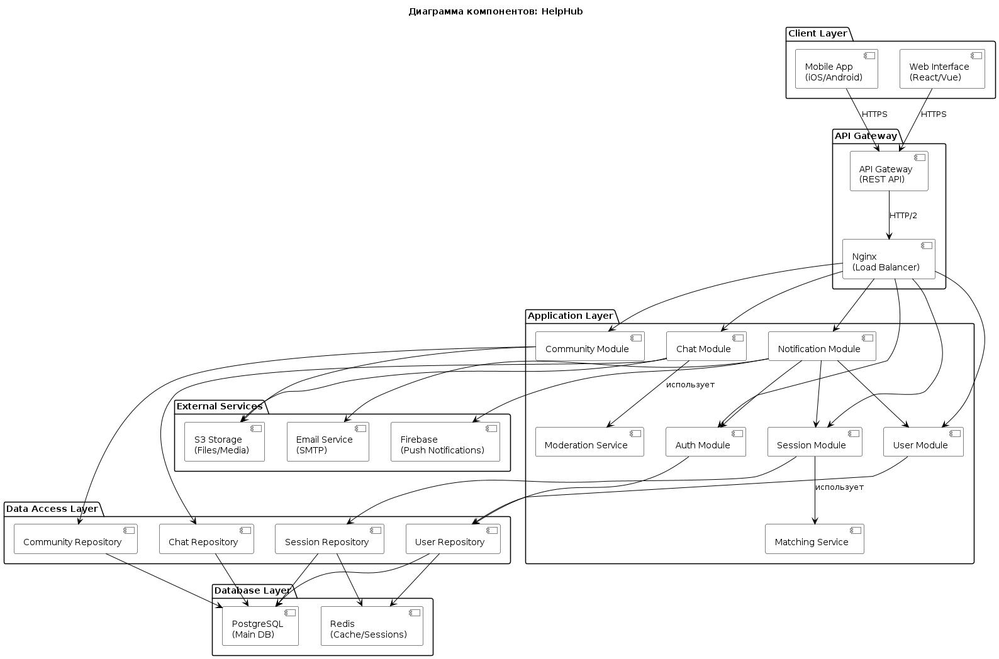
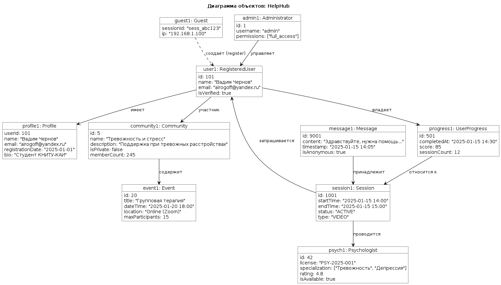
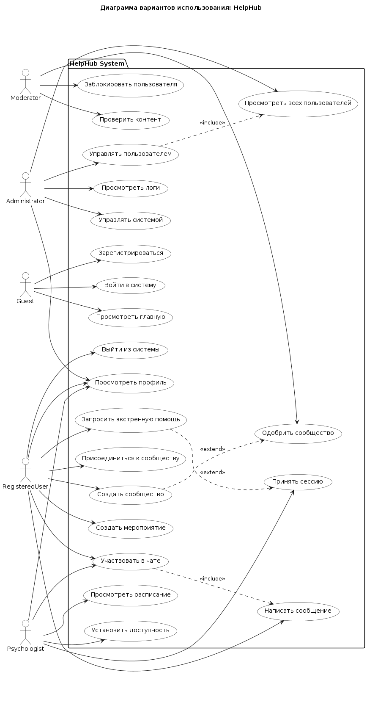
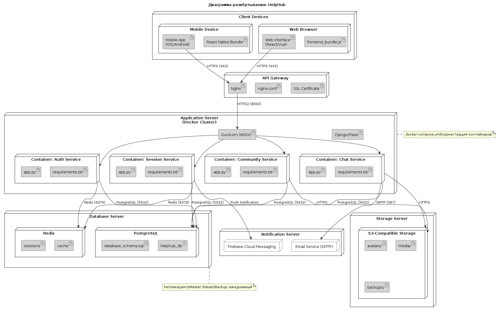

# 🔹 Лабораторная работа №3

## Диаграммы Классов, Объектов, Компонентов, Развёртывания
## 📋 1. Диаграмма компонентов

### Описание

Диаграмма компонентов отображает архитектурное разделение системы на три слоя: **клиентский**, **серверный** и **хранилища данных**.

**Клиентский слой** представлен мобильным приложением (iOS/Android) и веб-интерфейсом, которые взаимодействуют с сервером через **API Gateway** (REST API).

**Серверный слой** включает модули логики:
- `Auth Module` — аутентификация и авторизация
- `User Module` — управление пользователями
- `Session Module` — сессии психологической помощи
- `Community Module` — сообщества и мероприятия
- `Chat Module` — анонимный чат с модерацией
- `Notification Module` — уведомления и оповещения

Каждый модуль использует соответствующий **репозиторий** для доступа к данным. Репозитории обращаются к единой базе данных **PostgreSQL**.

**Дополнительные связи:**
- `Session Module` использует `Matching Service` для поиска психолога
- `Chat Module` использует `Moderation Service` для проверки контента
- `Notification Module` интегрирован со всеми сервисами

Такая структура обеспечивает **разделение ответственности** и **масштабируемость**.

### Диаграмма компонентов

---

## 📋 2. Диаграмма объектов

### Описание

Диаграмма объектов иллюстрирует конкретные экземпляры классов системы в определённый момент времени.

**Представлены объекты:**
- `guest1: Guest` — незарегистрированный посетитель
- `user1: RegisteredUser` — зарегистрированный пользователь (id=101, имя «Вадим Чернов», email: airogoff@yandex.ru)
- `psych1: Psychologist` — психолог (id=42, лицензия «PSY-2025-001», рейтинг 4.8)
- `admin1: Administrator` — администратор системы
- `profile1: Profile` — профиль пользователя
- `progress1: UserProgress` — запись прогресса (completedAt: 2025-01-15, score: 85)
- `session1: Session` — активная сессия (id=1001, status: ACTIVE)
- `community1: Community` — сообщество (id=5, name: «Тревожность и стресс»)
- `event1: Event` — мероприятие (id=20, title: «Групповая терапия»)

**Связи между объектами:**
- `user1` владеет несколькими записями `UserProgress`
- `session1` связана с `psych1` и `user1`
- `community1` содержит `user1` как участника
- `admin1` управляет `user1`
- `guest1` может создать `user1` через регистрацию

Диаграмма демонстрирует **реальные данные**, которые система обрабатывает во время работы.

### Диаграмма объектов

---

## 📋 3. Диаграмма вариантов использования

### Описание

Диаграмма вариантов использования описывает функциональность системы с точки зрения взаимодействия актёров.

**Выделены три актёра:**

| Актор | Описание |
|-------|----------|
| `Guest` | Незарегистрированный посетитель |
| `RegisteredUser` | Зарегистрированный пользователь |
| `Administrator` | Администратор системы |
| `Psychologist` | Сертифицированный специалист |
| `Moderator` | Модератор контента |

**Функционал:**

- **Guest:** зарегистрироваться, войти в систему, просмотреть главную страницу
- **RegisteredUser:** запросить экстренную помощь, присоединиться к сообществу, создать мероприятие, участвовать в анонимном чате, просмотреть профиль
- **Psychologist:** принять сессию, установить доступность, просмотреть расписание
- **Moderator:** проверить контент, заблокировать пользователя, одобрить сообщество
- **Administrator:** просмотреть всех пользователей, управлять системой, просмотреть логи

**Вариант использования «Управлять пользователем»** включает просмотр всех пользователей. **«Запросить помощь»** расширяется поиском психолога и созданием сессии.

Такая структура позволяет чётко разграничить **роли** и **доступный функционал**.

### Диаграмма вариантов использования

---

## 📋 4. Диаграмма развёртывания

### Описание

Диаграмма развёртывания показывает физическое распределение компонентов системы по узлам.

**Узлы системы:**

| Узел | Компоненты |
|------|------------|
| **Client Device** (Mobile/Web) | Мобильное приложение (iOS/Android), Веб-интерфейс (React/Vue) |
| **API Gateway** | Nginx (reverse proxy), Load Balancer |
| **Application Server** | Django/Flask (Python), Gunicorn (WSGI), Auth Service, Session Service, Community Service, Chat Service |
| **Database Server** | PostgreSQL (основная БД), Redis (кэш и сессии) |
| **Storage Server** | S3-compatible storage (файлы, аватары, медиа) |
| **Notification Server** | Firebase Cloud Messaging, Email Service (SMTP) |

**Артефакты, развёртываемые на узлах:**
- `frontend_bundle.js` — сборка фронтенда
- `app.py` — код приложения с зависимостями (`requirements.txt`)
- `database_schema.sql` — схема базы данных
- `nginx.conf` — конфигурация веб-сервера
- `docker-compose.yml` — оркестрация контейнеров

**Протоколы взаимодействия:**
- Client ↔ API Gateway: **HTTPS**
- API Gateway ↔ Application Server: **HTTP/2**
- Application Server ↔ Database: **PostgreSQL Protocol (5432)**
- Application Server ↔ Redis: **Redis Protocol (6379)**

Такая конфигурация обеспечивает **безопасное взаимодействие**, **масштабируемость** и **отказоустойчивость**.

### Диаграмма развёртывания

---

## 📁 Исходные файлы

| Файл | Описание |
|------|----------|
| `component-diagram.png` | Диаграмма компонентов |
| `component-diagram.wsd` | PlantUML код компонентов |
| `object-diagram.png` | Диаграмма объектов |
| `object-diagram.wsd` | PlantUML код объектов |
| `use-case-diagram.png` | Диаграмма вариантов использования |
| `use-case-diagram.wsd` | PlantUML код вариантов использования |
| `deployment-diagram.png` | Диаграмма развёртывания |
| `deployment-diagram.wsd` | PlantUML код развёртывания |

---

## ✅ Вывод

В ходе работы построены все статические диаграммы UML для системы HelpHub:

- **Диаграмма компонентов** показала модульную архитектуру backend-сервисов.
- **Диаграмма объектов** продемонстрировала конкретные экземпляры системы в runtime.
- **Диаграмма вариантов использования** описала функциональность с точки зрения актёров.
- **Диаграмма развёртывания** определила физическую инфраструктуру для хостинга.

